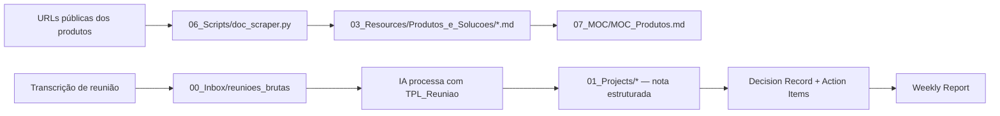

# 🧠 Product Brain

> Sistema de pensamento e tomada de decisão para líderes de produto e plataforma.
> Construído sobre **PARA Method** (Tiago Forte) + automação via Claude (Cowork) e Python.

---

## 🗂️ Estrutura PARA

| Pasta | Propósito |
|-------|-----------|
| [[00_Inbox/]] | Captura bruta (transcrições, ideias, leituras) — processar em ≤ 48h |
| [[01_Projects/]] | Iniciativas com **deadline** e entregável claro |
| [[02_Areas/]] | Responsabilidades **contínuas** sem deadline |
| [[03_Resources/]] | Base de conhecimento permanente e atemporal |
| [[04_Archives/]] | Projetos concluídos ou pausados |
| [[05_Templates/]] | Modelos versionados de notas |
| [[06_Scripts/]] | Ferramentas de automação |
| [[07_MOC/]] | Maps of Content — índices navegáveis |

---

## 🚀 Projetos ativos

- [[Projeto_Exemplo]] — substitua pelos seus projetos ativos

---

## 🏢 Áreas contínuas

- [[Lideranca_e_Pessoas]]
- [[Plataforma_e_Arquitetura]]
- [[Produto_e_UX]]
- [[Governanca_e_Compliance]]

---

## 📚 MOCs (Maps of Content)

- [[MOC_Produtos]] — documentação dos produtos (gerado automaticamente)
- [[MOC_Decisoes]] — histórico cronológico de Decision Records
- [[MOC_Reunioes]] — reuniões processadas e estruturadas

---

## ⚙️ Fluxos automatizados

---

## 🧩 Templates rápidos

- [[TPL_Reuniao]]
- [[TPL_Weekly_Report]]
- [[TPL_Feature_Doc]]
- [[TPL_Projeto]]
- [[TPL_Decision_Record]]
- [[TPL_1on1]]

---

> _"A mente é para ter ideias, não para guardá-las."_ — David Allen
